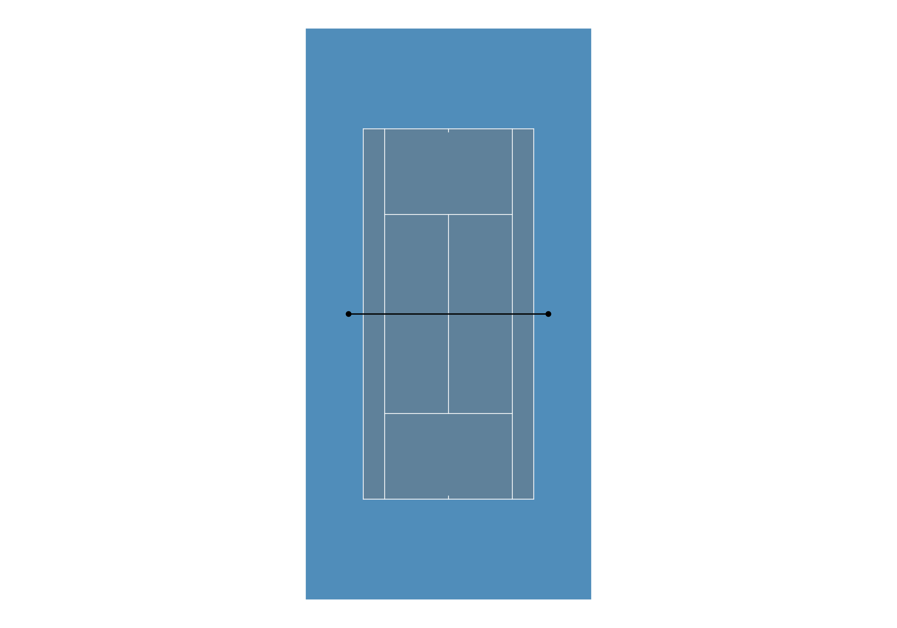
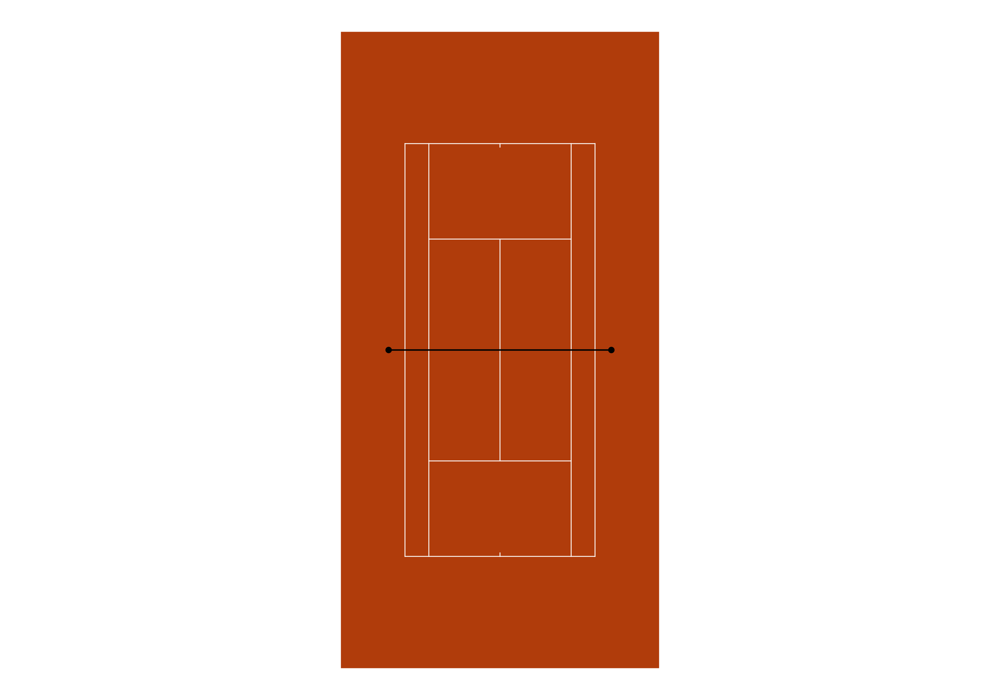
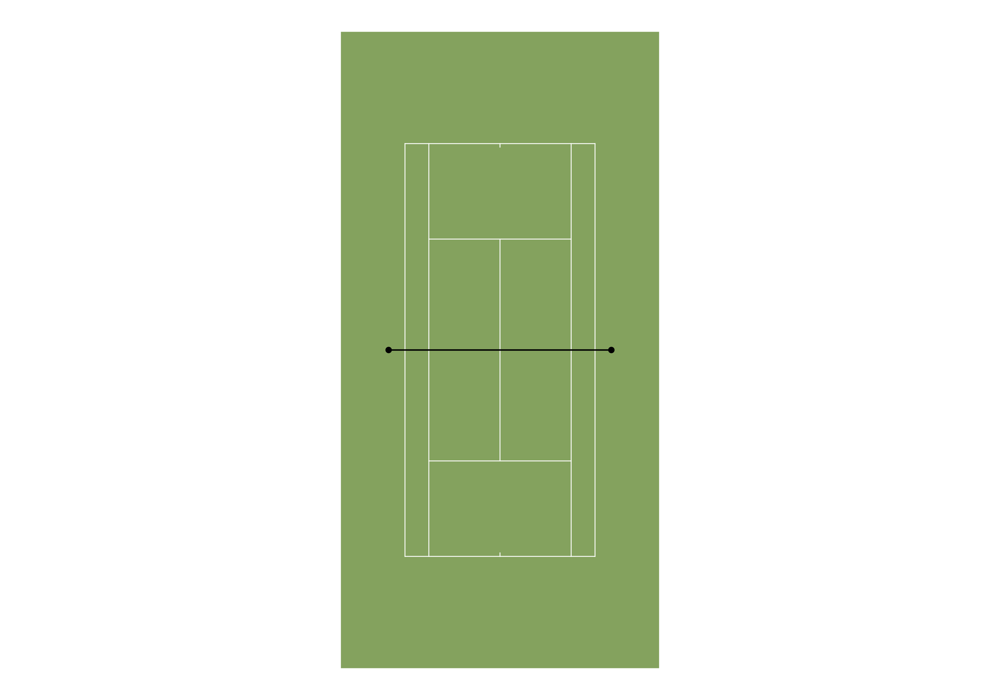
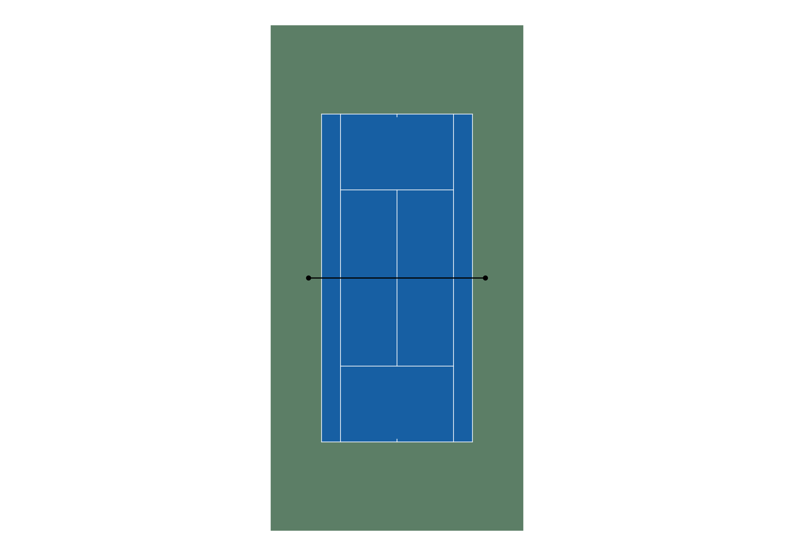

# PlotTennisCourt
This repository contains a function to plot a tennis court

## Contents
- `plot_tennis_court.R`: R script containing the function to plot a tennis court
- `PlotTennisCourt.Rproj`: R project file for the PlotTennisCourt project.
- `README.md`: This file providing an overview of the repository.
- `images`: Folder containing images of the plots that the function generates

## Example Plots
`plot_tennis_court(court_colour = "#5f819a", boundary_colour = "#508dba")` 

`plot_tennis_court(court_colour = "#b03c0b", boundary_colour = "#b03c0b")` 

`plot_tennis_court(court_colour = "#84a25e", boundary_colour = "#84a25e")` 

`plot_tennis_court(court_colour = "#175fa3", boundary_colour = "#5c7e66")` 

